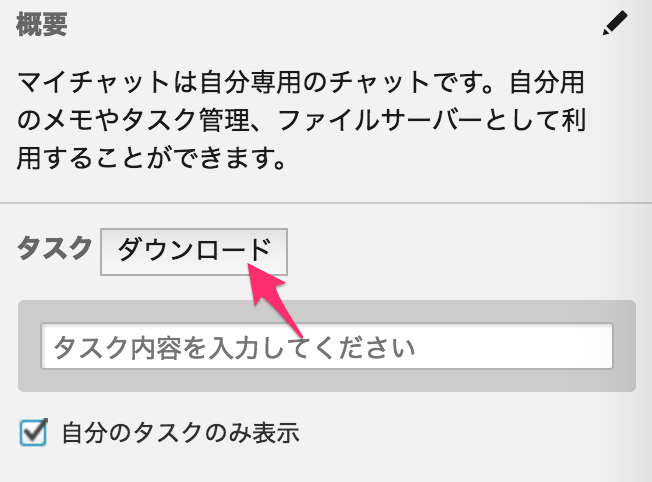

# Chatwork Task Downloader

Add a button to download Chatwork's task as a txt file.

> Chatworkのタスクをtxtファイルとしてダウンロードできるボタンを付けます。

[Download](https://chrome.google.com/webstore/detail/chatwork-task-downloader/kilpnofbnhcfaneepmnehobieoofeffh)
